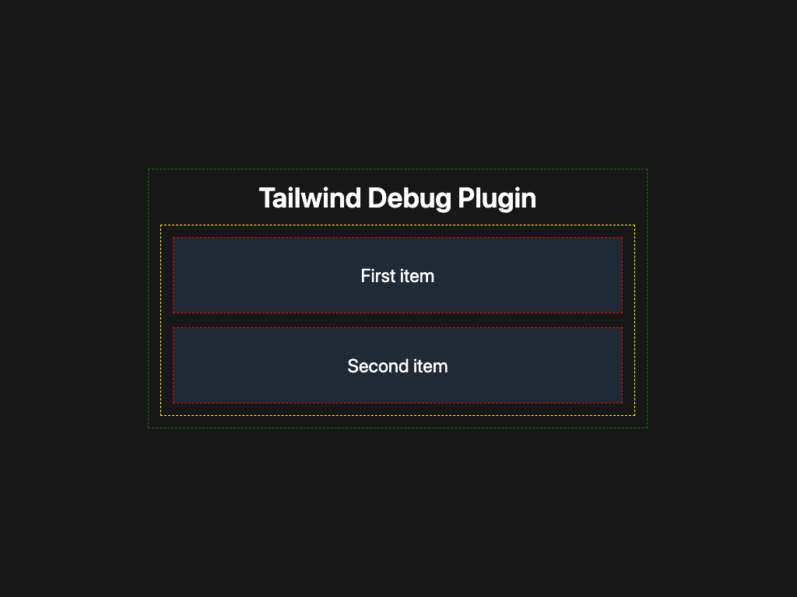

[](https://www.npmjs.com/package/tailwind-debug)
[](https://www.npmjs.com/package/tailwind-debug)
[](https://github.com/OzzyCzech/tailwind-debug/blob/main/LICENSE)

[](https://github.com/OzzyCzech/tailwind-debug/commit/main)

# Tailwind debug plugin

The Tailwind debug plugin is a helpful utility for web developers. This plugin allows users to quickly and easily add a red dashed outline over any HTML element.



## Installation

```shell
yarn add tailwind-debug
```

or

```shell
npm i tailwind-debug
```

## Usage

Add the plugin to your `tailwind.config.js` file:

```js
// tailwind.config.js
module.exports = {
  plugins: [
    require('tailwind-debug'),
  ],
}
```

then add the following class to your HTML element:

```html
<div class="debug"></div>
```